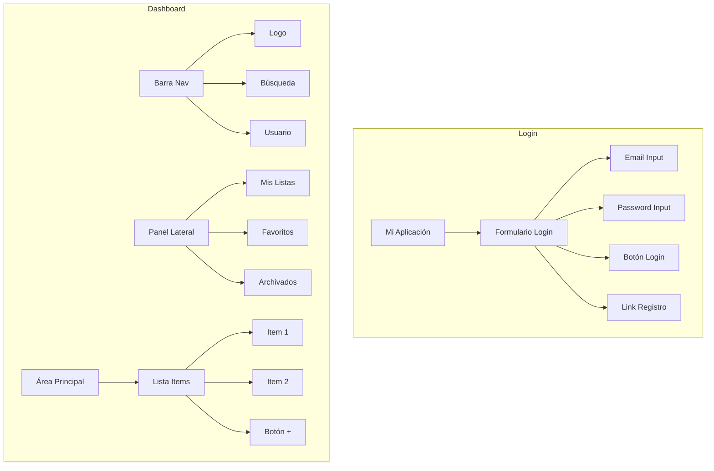

```mermaid
graph TD
    subgraph Login
    A[Mi Aplicación] --> B[Formulario Login]
    B --> C[Email Input]
    B --> D[Password Input]
    B --> E[Botón Login]
    B --> F[Link Registro]
    end

    subgraph Dashboard
    G[Barra Nav] --> H[Logo]
    G --> I[Búsqueda]
    G --> J[Usuario]
    K[Panel Lateral] --> L[Mis Listas]
    K --> M[Favoritos]
    K --> N[Archivados]
    O[Área Principal] --> P[Lista Items]
    P --> Q[Item 1]
    P --> R[Item 2]
    P --> S[Botón +]
    end
``` 